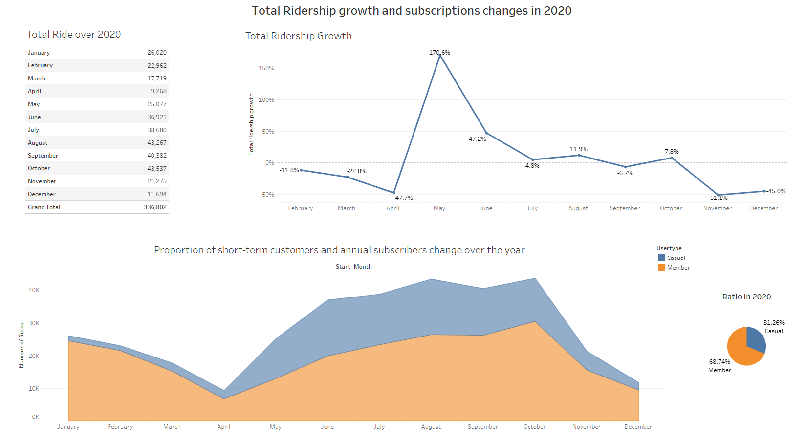
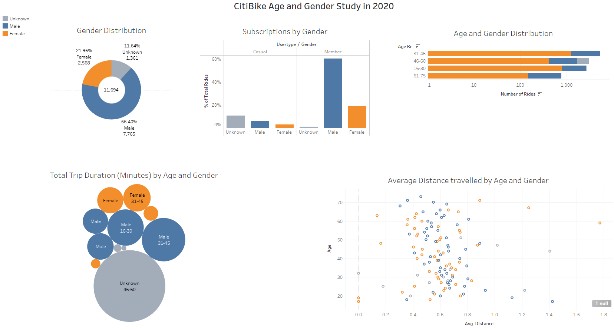
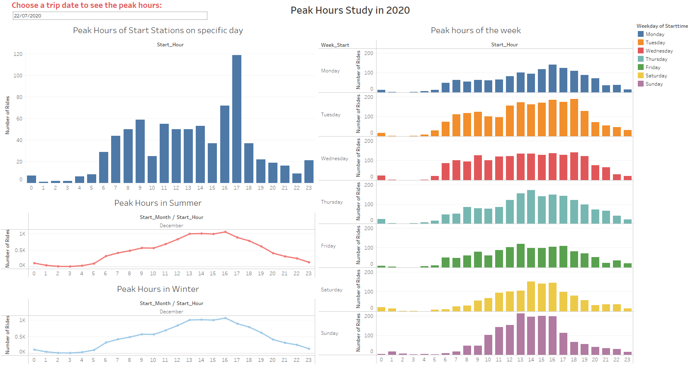
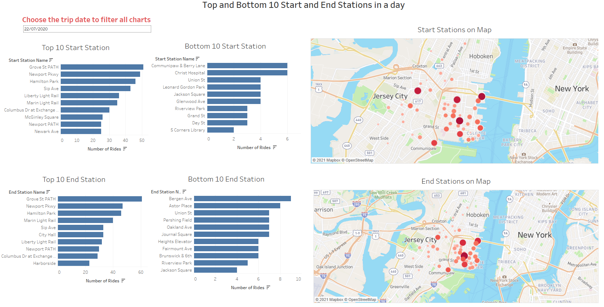
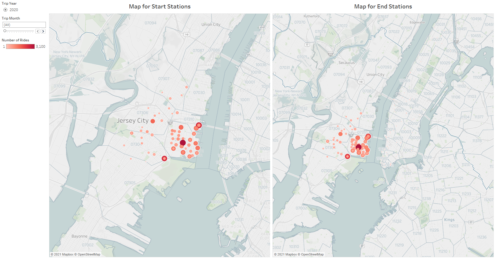

# CitiBike-Analytics-JerseyCity-2020


## Table of Contents

- [Table of Contents](#table-of-contents)
- [Introduction](#Introduction)
- [Structure](#Structure)
- [Setup](#Setup)
- [Datasets](#Datasets)
- [Analysis](#Analysis)
- [Contributors](#Contributors)
- [Technology](#Technology)

## Introduction

### background

Citi Bike is a privately owned public bicycle sharing system serving the New York City boroughs of the Bronx, Brooklyn, Manhattan, and Queens, as well as Jersey City, New Jersey.
Since 2013, the Citi Bike Program has implemented a robust infrastructure for collecting data on the program's utilization. Through the team's fforts, each month bike data is collected, organized, and made public on the Citi Bike Data webpage.

### Questions

This project tries to answer some questions about growth rate, age/gender distribution and peak hours 
and busy stations at different time spans in 2020.

## Structure
```
 
CitiBike-Analytics-JerseyCity-2020 
|
|__data/                            # Directory for the data files
|     |__ All monthly CSV files for 2020 for Jersey City
|
|__ images/
|     |__ All dashboard images and citi-bike-station-bikes View image
|
|__ bike_2020.csv                   # output 2020 CSV file used in Tableau
|__ CitiBike_2020.twbx              # Main Tableau file
|__ CitiBike_2020_Insights.pdf      # report file
|__ DataCleaning.ipynb              # Data Cleaning jupyter notebook file
|__ gitignore file
|__ README.md                       # read me file
                   

```

## Setup
Monthly datasets from January 2020 till December 2020 for Jersey City have been chosen for this 
insight. The datasets have been cleaned using python and dataset of year 2020 created by merging 
all monthly data. The output as a .csv file is used as data source in Tableau. 
The data includes:
* Trip Duration (seconds)
* Start Time and Date
* Stop Time and Date
* Start Station Name
* End Station Name
* Station ID
* Station Lat/Long
* Bike ID
* User Type (Customer = 24-hour pass or 3-day pass user; Subscriber = Annual Member)
* Gender (Zero=unknown; 1=male; 2=female)
* Year of Birth

The completed dashboard is located [here](https://public.tableau.com/app/profile/helen6080/viz/CitiBike_2020_16278308388900/Story-CitiBikeStory)

## Datasets
| # | Source | Link |
|-|-|-|
| 1 | Monthly datasets from January 2020 till December 2020 for Jersey City | [downloadable files of Citi Bike trip data](https://s3.amazonaws.com/tripdata/index.html) |


## Analysis

### Ridership growth and subscriptions changes in 2020
The first dashboard shows how many rides recorded in Jersey City in 2020. It includes a table of monthly totals of rides and a grand total of 336,802 for the year. 
The ridership growth line chart shows a decrease in ridership from Feb till April which could be a result of initial Covid-19 lockdown in New York. The increase after April also can be explained by the 4-phase reopening plan from April to July. The cold weather also could be the cause of next decrease around November.
Next visual shows the changes in ratios between annual subscribers and casual customers. Pandemic also can explain the increase of short-term customers ratio between April and October. But in total during 2020 the riders are more interested to get annual membership.



### Age and Gender Study in 2020
In this Dashboard, we can see that about 60% of the riders and around 50% of members are male. The riders in 31-45 age bracket show more interest than other age groups. The trip duration chart shows an odd record for known gender in 46-60 age bracket with more than 3 million minutes total trip duration. But regard less of this unusual record, Male in 31-45 age bracket have the top total trip duration 1,651,014 minutes. By looking at the chart for Average distance travelled, it’s obvious that Average distance of most trips are between 0.3 and 0.9 miles. Also, the total trip duration and average distance travelled are both showing minimum records for elderly females. Again, this can also be explained by the pandemic as elderly women are more careful about their health and not going out of home if not required.



### Peak Hours Study in 2020
This dashboard includes a user input filter to show pea###k hours for any specific day. The peak time between Monday to Friday is 6pm and during weekend the favourite times are around 3-4pm. The peak hours during the summer are around 6-7 pm and in winter are 8am and 6pm.



### Top and Bottom 10 Start and End Stations in a day
This dashboard is utilized to show top and bottom 10 start and end stations of the day chosen by user. There is a date filter in the page for this purpose. The page also includes start and end station maps which shows how busy they were in filtered date.



### Dynamic City Official Map
These two maps showing how busy the stations were for each month in 2020. There are year and month filters included in this page for this purpose. As dataset only includes 2020 data, the only year available is 2020 for filters. “Grove ST Path” seems a busy station over most of the months in 2020.




## Contributors

- [Helen Amin](https://github.com/helenamin)

## Technology

- 

- 